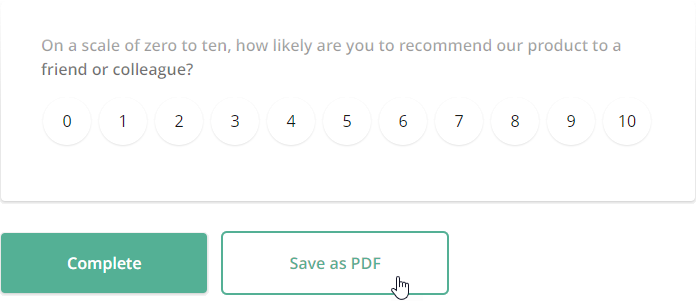

# Export Survey to PDF in a React Application

PDF Generator for SurveyJS allows your users to save surveys as interactive PDF documents. This tutorial describes how to add the export functionality to your React application.

-   [Install the `survey-pdf` npm package](#install-the-survey-pdf-npm-package)
-   [Configure Export Properties](#configure-export-properties)
-   [Export a Survey](#export-a-survey)

[View Full Code on GitHub](https://github.com/surveyjs/code-examples/tree/main/get-started-pdf/react "linkStyle")

If you are looking for a quick-start application that includes all SurveyJS components, refer to the following GitHub repositories:

-   <a href="https://github.com/surveyjs/surveyjs_react_quickstart" target="_blank">SurveyJS + React Quickstart Template</a>
-   <a href="https://github.com/surveyjs/surveyjs-nextjs" target="_blank">SurveyJS + Next.js Quickstart Template</a>
-   <a href="https://github.com/surveyjs/surveyjs-remix" target="_blank">SurveyJS + Remix Quickstart Template</a>

## Install the `survey-pdf` npm package

PDF Generator for SurveyJS is built upon the <a href="https://github.com/parallax/jsPDF#readme" target="_blank">jsPDF</a> library and is distributed as a <a href="https://www.npmjs.com/package/survey-pdf" target="_blank">`survey-pdf`</a> npm package. Run the following command to install the package and its dependencies, including jsPDF:

```cmd
npm install survey-pdf --save
```

## Configure Export Properties

Export properties allow you to customize the page format, orientation, margins, font, and other parameters. Refer to the [`IDocOptions`](/Documentation/Pdf-Export?id=idocoptions) interface for a full list of properties. The following code changes the [`fontSize`](/Documentation/Pdf-Export?id=idocoptions#fontSize) property:

```js
const pdfDocOptions = {
	fontSize: 12,
};
```

## Export a Survey

To export a survey, you need to create a `SurveyPDF` instance. Its constructor accepts two parameters: a [survey JSON schema](/Documentation/Library?id=design-survey-create-a-simple-survey#define-a-static-survey-model-in-json) and [export properties](#configure-export-properties). To save a PDF document with the exported survey, call the [`save(fileName)`](/Documentation/Pdf-Export?id=surveypdf#save) method on the `SurveyPDF` instance. If you omit the `fileName` parameter, the document uses the default name (`"survey_result"`).

The code below implements a `savePdf` helper function that instantiates `SurveyPDF`, assigns survey data (user responses) to this instance, and calls the `save(fileName)` method. If you want to export the survey without user responses, do not specify the `SurveyPDF`'s `data` property.

```js
import { SurveyPDF } from "survey-pdf";

const surveyJson = {
	/* ... */
};

const pdfDocOptions = {
	/* ... */
};

const savePdf = function (surveyData) {
	const surveyPdf = new SurveyPDF(surveyJson, pdfDocOptions);
	surveyPdf.data = surveyData;
	surveyPdf.save();
};
```

You can use any UI element to call this helper function. For instance, the code below adds a new [navigation button](/Documentation/Library?id=iaction) below the survey and calls the `savePdf` function when a user clicks this button.

> If you are using [Next.js](https://nextjs.org) or another framework that [has adopted React Server Components](https://react.dev/learn/start-a-new-react-project#bleeding-edge-react-frameworks), you need to explicitly mark the React component that renders a SurveyJS component as client code using the ['use client'](https://react.dev/reference/react/use-client) directive.

```js
// Uncomment the following line if you are using Next.js:
// 'use client'

import { Model } from "survey-core";
import { Survey } from "survey-react-ui";
// ...
function App() {
	const survey = new Model(surveyJson);

	survey.addNavigationItem({
		id: "pdf-export",
		title: "Save as PDF",
		action: () => savePdf(survey.data),
	});

	return <Survey model={survey} id="surveyContainer" />;
}

export default App;
```

The following image illustrates the resulting UI with the [Default V2 theme](/Documentation/Library?id=get-started-react#configure-styles) applied:



To view the application, run `npm run start` in a command line and open [http://localhost:3000/](http://localhost:3000/) in your browser.

<details>
    <summary>View Full Code</summary>

```js
// Uncomment the following line if you are using Next.js:
// 'use client'

import "./App.css";

import "survey-core/defaultV2.min.css";
import { Model } from "survey-core";
import { Survey } from "survey-react-ui";
import { SurveyPDF } from "survey-pdf";

const surveyJson = {
	// ...
};

const pdfDocOptions = {
	fontSize: 12,
};

const savePdf = function (surveyData) {
	const surveyPdf = new SurveyPDF(surveyJson, pdfDocOptions);
	surveyPdf.data = surveyData;
	surveyPdf.save();
};

function App() {
	const survey = new Model(surveyJson);

	survey.addNavigationItem({
		id: "pdf-export",
		title: "Save as PDF",
		action: () => savePdf(survey.data),
	});

	return <Survey model={survey} id="surveyContainer" />;
}

export default App;
```

</details>

[View Full Code on GitHub](https://github.com/surveyjs/code-examples/tree/main/get-started-pdf/react "linkStyle")

## Further Reading

-   [Customization Options](/Documentation/Pdf-Export?id=Customization-Options)
-   [Export HTML to PDF](/Documentation/Pdf-Export?id=HtmlToPdf)
-   [Export Matrix Questions to PDF](/Documentation/Pdf-Export?id=MatrixToPdf)
